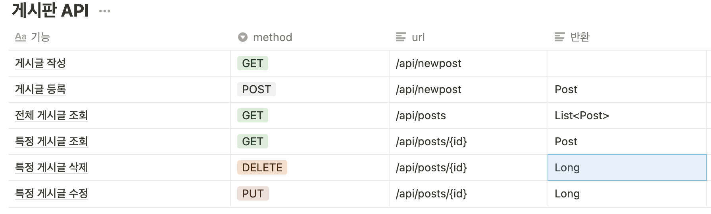
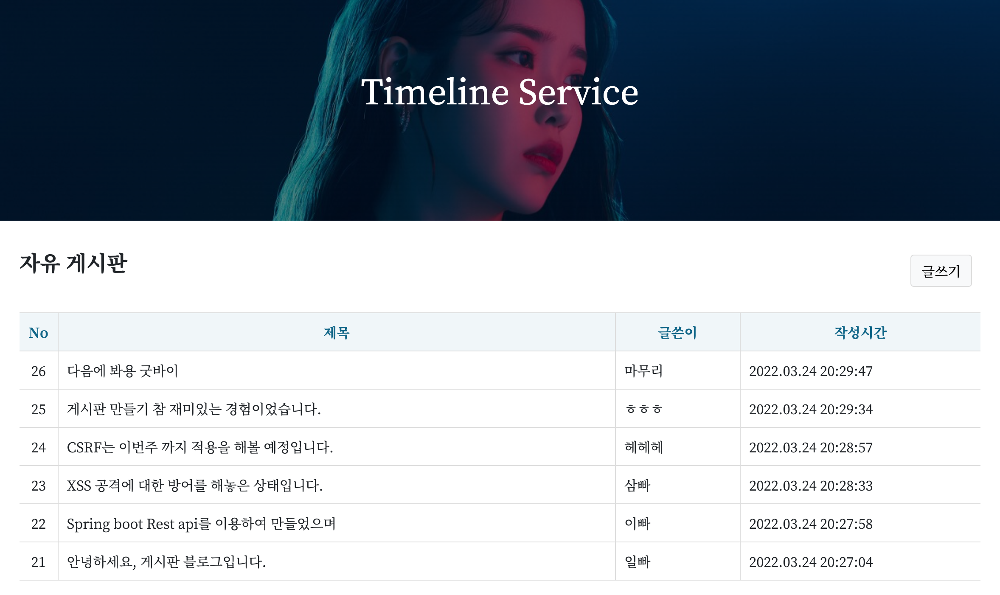
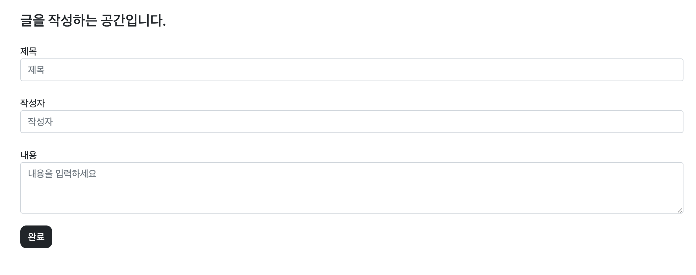
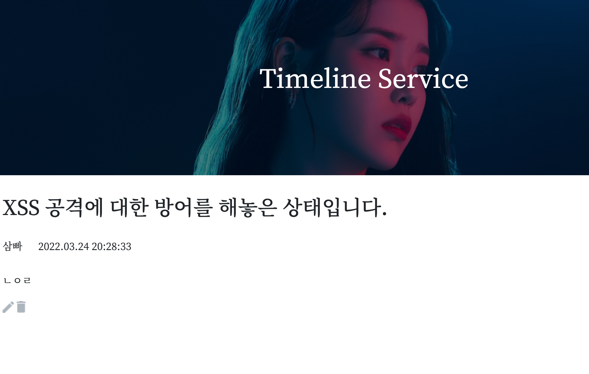

# 게시판 만들기
- 게시판의 CRUD 기능 구현.


## 🚀 학습 목표

```
 1. REST구조에 따른 API설계 및 정보 전달
 2. JPA활용한 데이터베이스 활용
 3. AWS EC2 적용한 배포, MySQL RDS 데이터베이스 활용
 ```

## 🍎 개요
명칭 : 게시판
개발 인원 : 1명
개발 기간 : 2022.03.21 ~ 2022.03.24
주요 기능 : 게시판 CRUD(작성, 조회, 수정, 삭제)
개발 언어 : JavaScript, Java
개발 라이브러리 : Spring
형상 관리 툴 : git
간단 소개 : 게시판의 기본 기능을 구현한 프로젝트

## ⭐️ API 설계

---


## 👍 Contents

---
### 메인 페이지


### 글 작성 페이지


### 글 조회 페이지



## 🚀 프로젝트 기간에 있었던 일 기록

---
1. XSS 공격에 대한 보안 적용  
https://daram.tistory.com/303
   

2. AWS에 실행 파일을 올렸을 때, 시간이 변경되는 문제 해결
https://daram.tistory.com/311
   

3. 프로세스와 스레드에 대한 개념 이해
https://daram.tistory.com/307
   
4. DB index의 전반적인 흐름, 개념 이해
https://daram.tistory.com/308